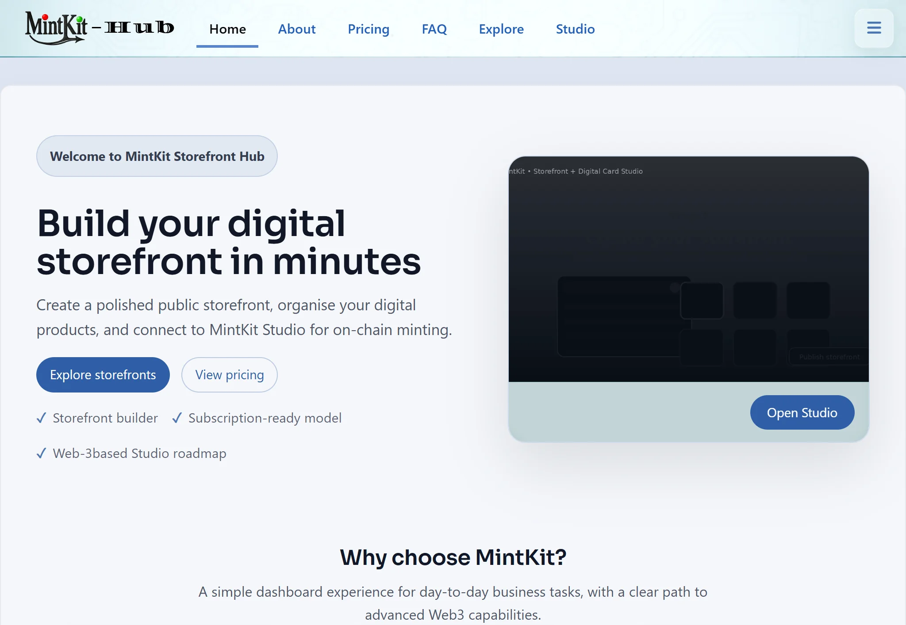
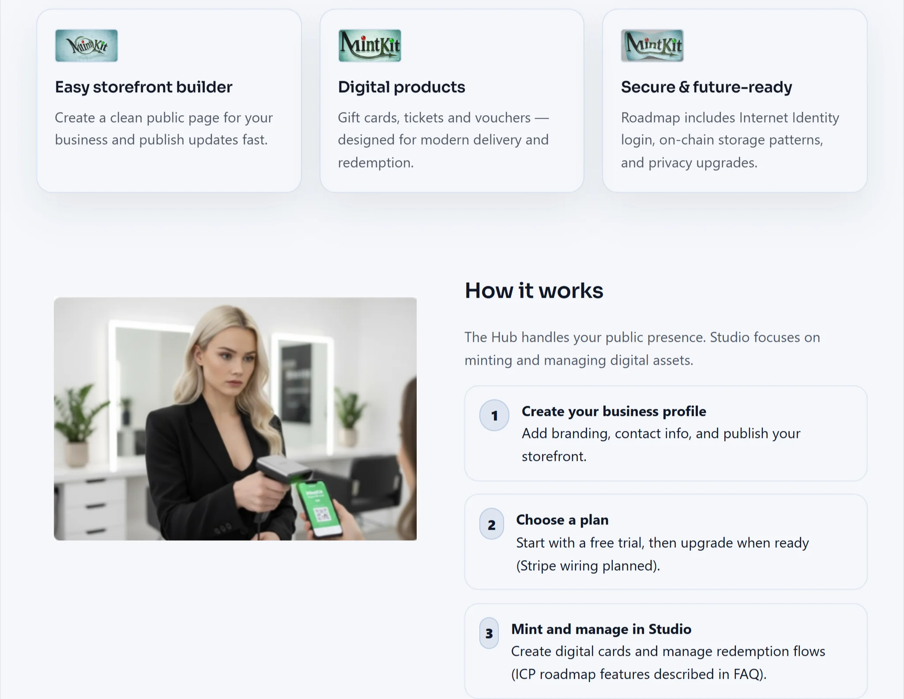
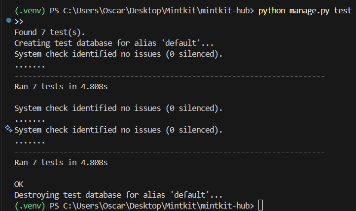
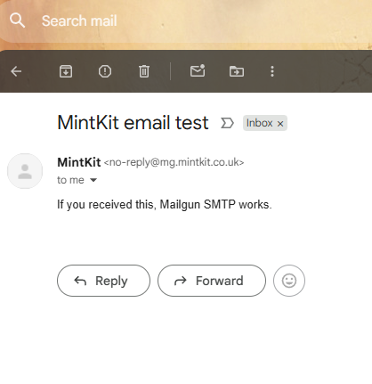

<p align="center">
  
</p>

<h1 align="center">MintKit Hub</h1>


## 1. Project Overview & Business Goals

<details>
  <summary>Click to expand <b>Project overview & goals</b></summary>

  <br>
 



### What is MintKit Hub?

MintKit Hub is a Django-based website for **small service businesses** (salons, gyms, tutors, therapists, etc.).

It does three main things:

1. Lets a business owner **create an account** and basic **profile**  
2. Gives them tools to build a simple **public storefront page** (name, description, active/inactive)  
3. Handles **subscriptions via Stripe** so they can access a separate MintKit app where digital gift cards, event tickets and vouchers are created and managed.

The MintKit app itself lives at a separate URL (for example `studio.mintkit.co.uk`) and is treated as a **third-party integration** for this project. MintKit Hub only controls access and provides the link.

### How it works – simple flow

For a typical business owner:

1. They visit **MintKit Hub**, register and log in.  
2. They fill in their **business profile** and create their **storefront** (e.g. “Beauty Salon”).  
3. They can preview and activate their storefront, which becomes publicly visible at a URL like:

   `https://mintkit.co.uk/storefront/beauty-salon/`

4. From their **dashboard** they start a **Stripe subscription** (with trial options).  
5. Once subscribed (or during a free trial), a dedicated **“Studio” tab** becomes useful.  
   On that Studio page they can open the external MintKit app (for example `studio.mintkit.co.uk`)  
   where they create and manage digital gift cards, tickets and vouchers.  
6. Customers visit the public storefront to learn about the business and follow links to purchase those digital products.


This repository contains only the **Django / Python Hub part** that will be graded for the Code Institute project.

### Business Goals

- Provide small service businesses with an easy way to set up a **simple branded storefront page**.  
- Offer a **subscription-based access model** (via Stripe) so businesses can unlock digital gift card / ticket / voucher tools in the external MintKit app.  
- Give business owners a clean **dashboard** where they can see:
  - basic profile information  
  - storefront status  
  - trial / subscription status  
- Demonstrate a secure, maintainable Django application with clear separation between:
  - the core platform (this repository), and  
  - the third-party MintKit integration.  
- Lay the groundwork for future enhancements such as richer analytics, storefront themes and deeper, more automated integration with MintKit.

</details>


## 2. UX: Target Audience & User Stories

<details>
  <summary>Click to expand <b>UX summary & user stories</b></summary>

### Target audience

The primary users are:

- **Small business owners** who want a simple online presence and the ability to sell digital gift cards, tickets or vouchers without building a full website from scratch.
- **Their customers**, who only see the public storefront pages and follow links to buy or redeem digital products.
- **The site owner / admin** (me, as project owner) who manages plans, subscriptions and occasionally updates storefront content via Django admin.

MintKit Hub focuses on making the experience simple for a busy non-technical business owner:
- clear navigation (Home → Dashboard → Storefront → Subscription)
- forms that only ask for essential information
- clear feedback about whether their storefront is public and whether they currently have access to the MintKit app.


### Key User Stories

#### Business Owner

- As a business owner, I want to register and log in so that I can securely access my storefront and dashboard.
- As a business owner, I want to create and edit my storefront details (name, description, contact info, logo) so that my customers see accurate, professional information about my business.
- As a business owner, I want to subscribe to MintKit Hub using Stripe so that I can unlock access to the MintKit app and its digital product tools.
- As a business owner, I want to see my current subscription status (plan, renewal date, active/inactive) on my dashboard so that I know whether I still have access to MintKit features.
- As a business owner, I want a dedicated **Studio** tab so that I always know where to go to open the MintKit app and manage my digital products.

#### Customer

- As a customer, I want to view a business’s storefront page so that I can understand what services or products they offer.
- As a customer, I want to see key information (description, contact details, opening hours, links) so that I can decide if this business suits my needs.
- As a customer, I want a straightforward and trustworthy experience when I interact with the storefront so that I feel confident using it.

#### Site Admin

- As a site admin, I want to see a list of registered business accounts so that I can monitor who is using the platform.
- As a site admin, I want to quickly check a business owner’s subscription status so that I can help with support queries.
- As a site admin, I want the system to restrict access to MintKit features to subscribed users only so that the business model remains sustainable.

*A more detailed UX document (personas, wireframes, and any additional stories) can be added later in `docs/UX.md` and linked from this section.*

Wireframes and UI screenshots: [docs/ux/UX.md](docs/ux/UX.md)


</details>


## 3. Data Model & ERD

<details>
  <summary>Click to expand <b>Data model & ERD details</b></summary>

### Data Model Overview

The data model for MintKit Hub is built around three main concepts:

1. **Users / Business Profiles** – who is using the platform.
2. **Storefronts** – how a business appears publicly.
3. **Subscriptions** – how access to the MintKit app is controlled via Stripe.

Django’s built-in `User` model is used for authentication, with additional project-specific models layered on top.

### Core Models (Planned)

> Note: Model names and fields may be refined slightly during implementation, but the core relationships will remain the same.

- **User** (Django built-in)
  - Handles authentication (username, email, password).
  - Related 1:1 to a `Profile`.

- **Profile**
  - Extends the `User` with business-related information.
  - Example fields:
    - `user` (OneToOneField to User)
    - `business_name`
    - `contact_email`
    - `logo` (optional)
    - `created_at`
  - Represents a business owner on the platform.

- **Storefront**
  - Represents the public-facing page for a business.
  - Example fields:
    - `profile` (OneToOneField or ForeignKey to Profile)
    - `slug` (used in URLs)
    - `headline`
    - `description`
    - `contact_details`
    - `is_active`
  - Used to display information to customers.

- **SubscriptionPlan**
  - Defines available subscription tiers.
  - Example fields:
    - `name` (e.g. Basic, Pro)
    - `price` (e.g. monthly cost)
    - `stripe_price_id` (link to Stripe pricing)
    - `description`
    - `is_active`
  - Allows the platform to offer different levels of service.

- **Subscription**
  - Connects a `Profile` to a `SubscriptionPlan` and tracks Stripe status.
  - Example fields:
    - `profile` (ForeignKey to Profile)
    - `plan` (ForeignKey to SubscriptionPlan)
    - `stripe_customer_id`
    - `stripe_subscription_id`
    - `status` (e.g. active, cancelled, past_due)
    - `start_date`
    - `end_date` (nullable for active subs)
  - Used to control whether a business owner can access the MintKit app.

- **MintKitAccess** (or similar integration model)
  - Stores any additional information needed to connect the user to the external MintKit app.
  - Example fields:
    - `profile` (OneToOneField to Profile)
    - `external_identifier` (e.g. ID used by MintKit)
    - `last_accessed_at`
  - This model keeps the integration concerns separate from core subscription logic.

### Relationships (High-Level)

- **User 1–1 Profile**  
  Each Django user has one profile with business-specific data.

- **Profile 1–1 / 1–* Storefront**  
  A profile owns one primary storefront (for this project).  
  (Could be extended to multiple storefronts in future.)

- **Profile *–* SubscriptionPlan via Subscription**  
  A profile can have one active subscription and possibly historical ones, each pointing to a plan.

- **Profile 1–1 MintKitAccess**  
  If a profile is connected to the external MintKit app, an integration record can store that link.

### Visual ERD

A Mermaid-based ERD is provided in [docs/ERD.md](docs/ERD.md), showing:

- `User` 1–1 `Profile`
- `Profile` 1–1 `Storefront`
- `Profile` 1–* `Subscription`
- `Subscription` *–1 `SubscriptionPlan`
- `Profile` 1–1 `MintKitAccess`

This matches the planned Django models described above.


</details>


## 4. Features

<details>
  <summary>Click to expand <b>Feature list</b></summary>

### Overview

MintKit Hub focuses on three main areas:

1. **Account & Access** – registration, login, and role-based access to the dashboard.
2. **Storefront Management** – letting business owners configure how their business appears publicly.
3. **Subscriptions & Integration** – using Stripe to control access to the external MintKit app.

The list below separates **core MVP features** (for this project) from **future enhancements** that are out of scope but planned.

---

### Core Features (MVP for this project)

#### 1. Authentication & Onboarding

- User registration with Django’s authentication system.
- Login and logout functionality with feedback messages.
- Basic profile setup for new business owners (business name, contact email, etc.).
- Access control so that only logged-in users can reach the dashboard and storefront management pages.

#### 2. Business Dashboard

- Authenticated dashboard page showing:
  - A welcome message and basic profile information.
  - Current subscription status (plan name, active/inactive).
  - Quick links to “Edit Storefront” and “Manage Subscription”.
- Clear messaging when a user is not yet subscribed and needs to start a plan.

#### 3. Storefront Management

- Create a storefront linked to the logged-in user’s profile.
- Edit storefront details:
  - Headline / description
  - Contact details
  - Optional logo or branding fields (if included)
- Toggle storefront **active/inactive**:
  - When **active**, the storefront is publicly visible to anyone (including unregistered visitors).
  - When **inactive**, the storefront is hidden from the public but still manageable by the business owner via the dashboard.
- Public storefront page accessible via a clean URL (e.g. `/storefront/<slug>/`).


#### 4. Stripe Subscription Integration & Trial Logic

- List of available subscription plans (e.g. Basic, Pro) with prices.
- Stripe Checkout integration to start a subscription:
  - User selects a plan.
  - Redirect to Stripe-hosted payment page.
  - Redirect back to success/cancel pages.
- Storage of relevant Stripe IDs on the `Subscription` model.
- Simple status display on the dashboard so the business owner can see if their subscription is active.
- **Trial behaviour:**
  - New users receive a time-limited free trial period (e.g. 14 days) during which they can still access the MintKit app without paying.
  - When a user starts a Stripe subscription, the plan is configured to include an initial free period (e.g. first month free), after which normal billing begins.


#### 5. External MintKit App Access

- A dedicated button/link on the dashboard that appears when the user has an active subscription.
- The link sends the user to the external MintKit app (e.g. `studio.mintkit.co.uk`) to manage gift cards, tickets, and vouchers.
- (Optional for this project) Store a simple integration record (`MintKitAccess` model) to track that the user has been connected.

#### 6. Admin & Maintenance

- Django admin configured for key models (Profile, Storefront, SubscriptionPlan, Subscription, MintKitAccess).
- Useful list/filter options in the admin to help with support (e.g. filter by subscription status).
- Basic error or info messages where appropriate (e.g. when a non-subscribed user tries to access subscriber-only features).

---

### Future / Stretch Features (Out of Scope for MVP)

These are ideas for future development and are not required for the initial Code Institute submission:

- Display of live sales or usage stats pulled from the external MintKit app.
- Allowing multiple storefronts per profile (for users with more than one business).
- Custom themes or templates for storefronts.
- Customer purchase flow directly inside the Django app, integrated with Stripe and/or MintKit.
- More advanced analytics on the dashboard (e.g. charts, trends, customer counts).

</details>


## 5. Technologies & Integrations (including Stripe & MintKit)

<details>
  <summary>Click to expand <b>Technologies & Integrations</b></summary>

### Core Technologies

- **Python 3** – main programming language for the backend.
- **Django** – main web framework used to implement the MintKit Hub application, including models, views, templates, and authentication.
- **HTML5** – structure of all pages.
- **CSS3** – styling and layout for the frontend (with a focus on responsiveness).
- **Bootstrap** (or similar CSS framework) – to speed up building a responsive and consistent UI.

### Database & Data Layer

- **SQLite** – default database for local development and testing.
- **(Planned) PostgreSQL** – database engine for production deployment (to be confirmed with hosting platform).
- **Django ORM** – used to define models and manage database queries.

### Stripe payments

- **Stripe Checkout** is used to handle subscription payments securely.  
- MintKit Hub never stores card data; it creates a **Checkout Session** and lets Stripe handle the card details.  
- The app stores only the minimum necessary Stripe IDs (customer, subscription, status) to know:
  - whether the user is in a **free trial**, and  
  - whether their subscription is currently **active**.

#### 5. External MintKit App Access

- A dedicated **Studio tab/page** available to logged-in business owners.
- The Studio page:
  - shows an **“Open MintKit Studio”** button when the user has trial or subscription access.
  - shows a clear message (and no active button) when the trial has ended and there is no active subscription.
- The “Open MintKit Studio” button links to the external MintKit app (e.g. `studio.mintkit.co.uk`) where gift cards, tickets, and vouchers are managed.
- (Optional for this project) Store a simple integration record (`MintKitAccess` model) to track that the user has been connected.


### Development & Tooling

- **Git** – version control.
- **GitHub** – remote repository hosting and project documentation (README, docs).
- **Virtual Environment** (`venv` or similar) – isolates Python dependencies for the project.
- **pip** – package manager for Python dependencies.

### Deployment (To Be Finalised)

The exact deployment stack will be documented once chosen (for example, a cloud platform that supports Django, PostgreSQL, and environment variables for Stripe keys). This section will be updated with:

- Hosting platform name.
- How static files are served.
- Any additional services involved in production.
---

### Third-Party Services, APIs & Scripts

MintKit Hub relies on a few external services and scripts:

- **Stripe Checkout & Stripe APIs**  
  Used to handle secure subscription payments for business owners. The Django backend communicates with Stripe’s API using the official Python SDK, and the frontend uses Stripe’s hosted Checkout pages for payment.

- **External MintKit App (3rd-party)**  
  A separately hosted application (for example at `studio.mintkit.co.uk`) that provides the actual tools for creating and managing digital gift cards, tickets, and vouchers. MintKit Hub does not contain this code; it simply controls access and links users to it.

- **(Planned) Analytics / Monitoring (optional)**  
  If added later (e.g. simple visit tracking or error monitoring), the chosen service and integration details will be documented here.

For a more detailed description of how Stripe and the external MintKit app fit together,
see [docs/STRIPE_MINTKIT_INTEGRATION.md](docs/STRIPE_MINTKIT_INTEGRATION.md).

#### Client-side Scripts & External References  
*(Layout Editor + Public Storefront Scaling)*

The **Storefront Layout Editor** and the **Public Storefront scaled layout** behaviour are implemented with custom JavaScript, using standard browser Web APIs and Django template helpers. These scripts do not rely on external drag/drop libraries; instead, they follow documented browser patterns and Django helpers.

---

##### Storefront Layout Editor script  
*(My Storefront → Edit layout)*

**Purpose:**
- Allows storefront owners to drag, resize, and style content blocks (logo, headline, description, cards grid, contact blocks).
- Supports “Fit” preview mode and saving layout, styles, and background to the database.

**Key Web APIs / patterns referenced:**
- DOM manipulation & pointer events (drag/move/resize patterns)
- Fetch API (AJAX save/load)
- `window.localStorage` (draft/persistence patterns)
- CSS transforms (`scale`, `transform-origin`)
- Font Loading API (`document.fonts.ready`) for reliable font changes
- Element sizing and positioning (`getBoundingClientRect`)

**Notes on originality / adaptation:**
- Custom implementation for this project, following common patterns described in MDN Web Docs.
- Uses Django documentation for safe JSON embedding (e.g., `json_script`).

---

##### Public Storefront scaled-layout script  
*(Public Storefront page)*

**Purpose:**
- Applies saved positions, sizes, and styles from the Layout Editor.
- Ensures readability across screen sizes by scaling the entire design surface to fit smaller viewports.

---

##### References used (documentation / patterns)

- **MDN Web Docs (JavaScript / DOM / Web APIs)**  
  Reference for DOM manipulation, event handling, and browser APIs such as Fetch, localStorage, and transforms.

- **Django documentation**  
  Reference for safely embedding structured JSON into templates using `json_script`.

---

##### Project-specific customisations (summary)

- **Fit mode:** Uses scale calculations so the full layout can be previewed inside the editor canvas.
- **Font selection:** Injects Google Fonts once and applies typography consistently across headings and text nodes.
- **Editor surface growth:** Dynamically increases vertical space when blocks are moved/resized downward.
- **Public storefront scaling:** Applies saved positions/sizes and scales the design surface down on smaller screens.

---

##### AI support (development aid)

Debugging and refactoring guidance was assisted by AI tooling. Final code was reviewed, integrated, and tested in the project codebase.

---

### Responsive navbar (burger menus)

Purpose:
A small vanilla JavaScript toggle script is used to show/hide navigation links on tablet/mobile.  
It supports two toggles (left menu + right user/account menu) to prevent the navbar wrapping on small screens.

Implementation notes (project-specific changes):
- Two independent menus (left + right), each with its own toggle button and panel.
- Uses `classList.toggle()` to control visibility via CSS classes.
- Uses basic accessibility attributes (`aria-label`, optional `aria-expanded`) to keep buttons screen-reader friendly.

Source / reference:
Custom script written for this project, based on common responsive navigation patterns and standard DOM APIs.
Reference material: MDN Web Docs (DOM `classList`, event listeners, ARIA attributes).

---

### Public Storefront Link — Copy / Share Buttons (JS)

**Purpose:**  
On the “My storefront” page, users can quickly copy their public storefront URL or share it using the device share sheet.

**How it works (high level):**
- **Copy** uses the browser Clipboard API to copy the URL string.
- **Share** uses the Web Share API where supported (mainly mobile browsers). If unsupported, the button can be hidden/disabled.

**Browser APIs used:**
- `navigator.clipboard.writeText()` (Clipboard API)
- `navigator.share()` (Web Share API)

**Notes / limitations:**
- Clipboard API generally requires **HTTPS** (localhost is usually allowed for development).
- Web Share API availability varies by browser/device; it is commonly supported on mobile.

**Source / attribution:**
- Script logic inspired by standard DOM event patterns and Web API usage examples from MDN documentation.
- Implementation was adapted to MintKit Hub UI and layout.

**UX detail:**
- After a successful copy action, the UI should provide feedback (e.g., temporary “Copied!” label, small toast message, or button text change).
---

## Standards-based Scripts (small custom JS)

**HTMLMediaElement playback rate control (video speed)**  
- _Use_: Slows the promo video playback to improve the “ad feel” (e.g. 0.7× speed).  
- _Source_: MDN documentation for `HTMLMediaElement.playbackRate`.  
- _Ref_: https://developer.mozilla.org/en-US/docs/Web/API/HTMLMediaElement/playbackRate

Example implementation (MintKit Hub):

```html
<!-- Home page video -->
<video id="mkHeroVideo" class="mk-media-video" autoplay muted loop playsinline>
  <source src="" type="video/mp4">
</video>

<script>
  // Slows down the hero promo video to ~0.7x (standards-based: HTMLMediaElement.playbackRate)
  // Ref: https://developer.mozilla.org/en-US/docs/Web/API/HTMLMediaElement/playbackRate
  document.addEventListener("DOMContentLoaded", () => {
    const vid = document.getElementById("mkHeroVideo");
    if (!vid) return;

    const applyRate = () => { vid.playbackRate = 0.7; };

    // Some browsers apply reliably after metadata is loaded
    if (vid.readyState >= 1) applyRate;
    else vid.addEventListener("loadedmetadata", applyRate, { once: true });
  });
</script>
```
---
### Email (Mailgun SMTP + Cloudflare Email Routing)

MintKit Hub sends transactional emails (e.g. basic notifications) using **Mailgun SMTP** on the verified subdomain:

- Sending domain: `mg.mintkit.co.uk`
- Example sender: `MintKit <no-reply@mg.mintkit.co.uk>`

Incoming support mail is handled via **Cloudflare Email Routing**, forwarding:
- `support@mintkit.co.uk` → a verified destination inbox (temporary academic inbox during development)

**Why `mg.` subdomain?**  
Using a dedicated mail subdomain helps deliverability and keeps DNS/email records isolated from the main website domain.

---


</details>


## 6. Project Setup & Milestones

<details>
  <summary>Click to expand setup instructions & milestones</summary>

### Local Project Setup

These steps describe how to get MintKit Hub running locally for development.

1. **Clone the repository**

   ```bash
   git clone https://github.com/Oscar-Ivs/mintkit-hub.git
   cd mintkit-hub

2. **Create and activate a virtual environment**

   ```bash
   python -m venv venv
   venv\Scripts\activate


3. **Install dependencies**

(A requirements.txt file will be added as the project develops.)

```bash
pip install -r requirements.txt
python manage.py migrate
```

4. **Set environment variables**

Create a .env file (or use chosen method for environment variables) and add keys such as:

SECRET_KEY=your-secret-key-here

DEBUG=True

STRIPE_PUBLIC_KEY=pk_test_...

STRIPE_SECRET_KEY=sk_test_...

STRIPE_WEBHOOK_SECRET=whsec_...


In development, the project will use SQLite by default; production database configuration will be documented in the Deployment section.

5. **Apply migrations**

python manage.py migrate

6. **Create a superuser (for Django admin)**

python manage.py createsuperuser

7. **Run the development server**

python manage.py runserver

The site should now be accessible at http://127.0.0.1:8000/

## Project Milestones / Roadmap

This project will be built in small, focused milestones:

#### Milestone 1 – Project Skeleton

- Create Django project and core apps (e.g. `accounts`, `storefronts`, `subscriptions`, `core`).
- Configure base templates, navigation, and basic URL structure.
- Set up GitHub repo and initial documentation structure (`README`, `docs/`).

#### Milestone 2 – Accounts & Profiles

- Implement registration, login, and logout using Django auth.
- Create `Profile` model linked to the `User`.
- Build a simple profile page and initial dashboard.

#### Milestone 3 – Storefront Management

- Implement `Storefront` model and CRUD views.
- Allow business owners to create and edit their storefront.
- Add public storefront pages (active/inactive behaviour included).

#### Milestone 4 – Subscriptions & Stripe Integration

- Implement `SubscriptionPlan` and `Subscription` models.
- Connect to Stripe (test mode) using Stripe Checkout.
- Add trial logic and dashboard status display.
- Show/hide access to the external MintKit app based on trial/subscription status.

#### Milestone 5 – Polish, Testing & Deployment

- Refine UI, messages, and navigation.
- Document and run manual tests (plus any automated tests if included).
- Finalise deployment to the chosen hosting platform.
- Update README, testing docs, and CI criteria mapping.
</details>


## 7. Testing (Summary)

<details>
  <summary>Click to expand <b>Testing summary</b></summary>
  
If more granular test cases are required in future iterations, these may be expanded into a dedicated `docs/TESTING.md` file.

---

## Key Areas Covered

- User registration, login, and logout
- Profile creation and editing (business details)
- Storefront creation, editing, and active/inactive visibility
- Public storefront access rules:
  - Active storefronts visible to everyone
  - Inactive storefronts visible only to the owner (or admin)
- Dashboard behaviour:
  - Trial status display
  - Subscription status display
  - Conditional MintKit access button visibility
- Stripe subscription flow (test mode):
  - Checkout session initiation
  - Success and cancel redirect handling
- Django admin access and model visibility
- General UI checks (navigation, messages, error handling)

---

---

## Automated Tests (Django)

A small automated test suite was added to validate the most important flows (authentication + storefront access rules) using Django’s built-in test runner.

### How to run

```bash

python manage.py test
```

Latest result:

The current suite contains 7 tests and completes successfully:



---

## Example Manual Test Checklist

A more detailed checklist may be expanded into `docs/TESTING.md`, but core tests include:

- [ ] Register a new business owner account
- [ ] Log in and log out successfully
- [ ] Create and update a business profile
- [ ] Create a storefront and view it publicly while active
- [ ] Set a storefront to inactive and confirm it is hidden from public users
- [ ] Start the Stripe subscription flow (test mode)
- [ ] Complete a Stripe test payment or trial
- [ ] Verify dashboard subscription and trial indicators
- [ ] Verify MintKit access button visibility rules
- [ ] Confirm unauthenticated users are redirected to login

---

# 🧪 Testing Scope & Limitations

Testing for **MintKit Hub** focuses exclusively on the **public-facing web application**.

The following areas are **out of scope** for this phase:

- Internet Identity authentication
- QR-code redemption flows
- Internal MintKit app / canister logic
- Third-party service internals (Stripe, CDN providers)

Where third-party services are involved, testing is limited to **verification of correct integration**, not internal behaviour.

---

## Lighthouse Testing

Lighthouse audits were carried out using **Chrome DevTools Lighthouse (v13.x)** in **Navigation mode**, covering both **Desktop** and **Mobile** profiles.

- **Desktop:** Emulated desktop device
- **Mobile:** Emulated Moto G Power, Slow 4G throttling
- **Reports:** Exported as PDF and stored as evidence

### Pages Tested

- Home
- About
- Explore
- Pricing
- FAQ
- Dashboard
- My Storefront

Each page was tested on **Desktop and Mobile** (14 reports total).

**Evidence:**  
**Evidence:**  
PDF reports stored in [`docs/testing/lighthouse/`](docs/testing/lighthouse/)

---

## Lighthouse Results Summary (Baseline)

| Page | Device | Performance | Accessibility | Best Practices |
|------|--------|-------------|---------------|----------------|
| Home | Desktop | 98 | 100 | 77 |
| Home | Mobile | 71 | 100 | 77 |
| About | Desktop | 97 | 100 | 77 |
| About | Mobile | 73 | 100 | 77 |
| Explore | Desktop | 97 | 100 | 77 |
| Explore | Mobile | 72 | 100 | 77 |
| Pricing | Desktop | 98 | 96 | 77 |
| Pricing | Mobile | 75 | 96 | 77 |
| FAQ | Desktop | 97 | 100 | 77 |
| FAQ | Mobile | 74 | 100 | 77 |
| Dashboard | Desktop | 96 | 96 | 77 |
| Dashboard | Mobile | 70 | 96 | 77 |
| My Storefront | Desktop | 97 | 96 | 77 |
| My Storefront | Mobile | 73 | 96 | 77 |

---

## Lighthouse Results Summary (After Improvements)

Lighthouse audits were repeated after applying static asset and caching optimisations.  
Tests were performed using a **freshly registered user account without uploaded profile images or storefront logos** to minimise variance caused by user-generated media.

| Page | Device | Performance | Accessibility | Best Practices | Change |
|------|--------|-------------|---------------|----------------|--------|
| Home | Desktop | 99 | 100 | 77 | +1 |
| Home | Mobile | 76 | 100 | 77 | +5 |
| About | Desktop | 99 | 100 | 77 | +2 |
| About | Mobile | 90 | 100 | 77 | +17 |
| Explore | Desktop | 99 | 100 | 77 | +2 |
| Explore | Mobile | 72 | 100 | 77 | 0 |
| Pricing | Desktop | 98 | 96 | 77 | 0 |
| Pricing | Mobile | 75 | 96 | 77 | 0 |
| FAQ | Desktop | 98 | 100 | 77 | +1 |
| FAQ | Mobile | 74 | 100 | 77 | 0 |
| Dashboard | Desktop | 96 | 96 | 77 | 0 |
| Dashboard | Mobile | 70 | 96 | 77 | 0 |
| My Storefront | Desktop | 97 | 96 | 77 | 0 |
| My Storefront | Mobile | 88 | 100 | 77 | +15 |

> Pages that include user-generated content (logos, thumbnails, storefront images) show variable Lighthouse performance depending on account state. Improvements were most visible when static asset overhead was reduced.

---

## Key Observations

### Accessibility

- Accessibility scores are consistently **96–100**
- No critical accessibility failures detected
- Minor issues relate to:
  - Colour contrast in some storefront elements
  - List semantics in tabular content

These issues do not block usability.

---

### Performance (Desktop vs Mobile)

- **Desktop performance remains consistently high (96–99)** across all pages
- **Mobile performance remains lower (70–76)** due to Lighthouse throttling

Key stability metrics remain strong:

- **Total Blocking Time (TBT): 0 ms**
- **Cumulative Layout Shift (CLS): 0**

Example metrics:
- Home Desktop LCP: **~1.0s**
- Home Mobile LCP: **~5.4s**

---

### Best Practices (Consistent Score: 77)

All pages report a **Best Practices score of 77**.

Primary cause:

- **“Uses third-party cookies — 7 cookies found”**

These originate from external resources (e.g. Google Fonts, Font Awesome CDN) and are not set by application logic.

This limitation is documented and accepted at this stage.

---

## Common Performance Issues Identified

Across all pages, Lighthouse highlights similar improvement opportunities:

| Issue | Typical Impact |
|------|----------------|
| Render-blocking CSS and fonts | Mobile savings up to ~2,800 ms |
| Inefficient cache lifetimes | 167 KiB – 1,187 KiB |
| Image delivery optimisation | Up to ~700 KiB |
| Font display optimisation | ~40–70 ms |

These issues are **systemic**, meaning improvements applied once benefit multiple pages.

---

## Manual & Visual Testing

In addition to automated testing:

- Pages were manually reviewed on desktop and mobile viewports
- Layout responsiveness and navigation behaviour were verified
- No layout shifts, broken navigation paths, or blocking UI issues were observed

---

## Future Testing & Optimisation

Planned for future iterations:

- Self-hosting of third-party assets (e.g. Font Awesome)
- Further render-blocking CSS optimisation
- Automated front-end testing
- Deeper accessibility audits (screen reader testing)
- Re-testing after asset pipeline enhancements

---

## HTML & CSS Validation:

### CSS Validation

The main stylesheet was validated using the W3C CSS Validator.

- Errors: 0
- Warnings: 27

All warnings relate to vendor-specific extensions (e.g. `-webkit-*`) and the use of CSS variables for cross-browser compatibility and responsive design. These warnings are expected and were intentionally retained.

**Evidence:**  
**Evidence:**  
Screenshot stored in [`docs/testing/validation/html_validator.png`](docs/testing/validation/html_validator.png)


---

### HTML Validation

Key templates were validated using the Nu HTML Checker (W3C / Validator.nu) by pasting the rendered HTML output (local development environment).

- Errors: 6
- Warnings: 0

Templates validated include:
- `home.html`
- `about.html`
- `pricing.html`
- `faq.html`
- `explore_storefronts.html`
- `dashboard.html`
- `my_storefront.html`

**Evidence:**  
**Evidence:**  
Screenshot stored in [`docs/testing/validation/css_validation_success.png`](docs/testing/validation/css_validation_success.png)


#### Validation fixes applied

During HTML validation, a small number of issues were identified and resolved:

- **Errors fixed:** 6  
- **Warnings addressed:** 0 (HTML)  
- **Affected templates:** Home, Pricing, Explore, My Storefront

Issues included invalid element nesting, placeholder image attributes, improper anchor disabling, and incorrect ARIA usage.

After applying fixes, all validated templates return **0 HTML errors / 0 warnings**.

## Email integration testing

### Automated (unit test)
Email sending is tested using Django’s in-memory backend (`locmem`) to avoid external SMTP dependency:

```bash
python manage.py test
```
<p>
  
  
</p>

### Manual verification (SMTP)

Mailgun SMTP was verified manually using the Django shell:

```bash
python manage.py shell
```
A test email was sent successfully using EmailMessage, confirming Mailgun SMTP credentials and DNS verification are correct.

---

## Testing Coverage (What was tested vs not tested)

### Tested in this project (current scope)
- Core user journeys (register, login/logout, dashboard access)
- Profile creation and updates
- Storefront creation, edit, active/inactive visibility rules
- Explore page visibility rules (public only sees active storefronts)
- Navigation, redirects, and feedback messages
- Lighthouse audits (Desktop + Mobile) and performance improvements where feasible
- HTML/CSS validation (W3C)

### Not tested / out of scope for this phase
The following are either not implemented yet or cannot be fully tested within the constraints of this project:

- Internet Identity authentication flows (external)
- QR redemption flow and MintKit Studio / canister logic (external app)
- Full Stripe payments (real card payments, refunds, disputes)
- Email sending/receipts (not implemented yet)
- High-load / concurrency testing (e.g. many users purchasing simultaneously)
- Automated UI testing suites (planned for future iteration)

### Future testing plan (when features expand)
If/when MintKit Hub moves beyond the current college scope, testing would be expanded to include:

- Stripe end-to-end purchase flows in test mode (webhooks, receipts, failure states)
- Email workflows (delivery, retries, template rendering)
- Concurrency / load testing (multiple simultaneous purchases)
- Automated tests:
  - Django unit tests for models/forms/views
  - Integration tests for key flows (login, storefront publish/unpublish)
  - Basic UI tests for critical pages


</details>


## 8. Deployment

<details>
  <summary>Click to expand <b>Deployment overview</b></summary>

### Hosting Platform

The MintKit Hub Django application is deployed to **Heroku** with the following setup:

- **Heroku Web Dyno** running the application via **Gunicorn**
- **Heroku Postgres** as the production database
- **Environment variables** for all sensitive configuration
- **WhiteNoise** for serving static files
- **Git-based deployment** via the Heroku CLI

**Live URL:**  
https://mintkit-hub-8a979ce863e4.herokuapp.com/

---

### Environment Variables (Heroku Config Vars)

The following environment variables are configured in the Heroku dashboard:

| Variable Name | Purpose |
|--------------|--------|
| `SECRET_KEY` | Django secret key (production-safe) |
| `DEBUG` | Set to `False` in production |
| `ALLOWED_HOSTS` | Comma-separated hosts (e.g. `mintkit-hub.herokuapp.com,mintkit-hub-8a979ce863e4.herokuapp.com`) |
| `DATABASE_URL` | Automatically added by Heroku Postgres |

---

### Production Settings Summary

The project is configured so production values come from environment variables:

- `DEBUG` is controlled by the `DEBUG` env var (default `False`)
- `ALLOWED_HOSTS` is populated from `ALLOWED_HOSTS`
- Database switches to Postgres automatically when `DATABASE_URL` exists

---

### Deployment Steps (Heroku)

1. **Install required packages**
   - Ensure `gunicorn`, `whitenoise`, and `dj-database-url` are in `requirements.txt`.

2. **Add a Procfile**
   - Create a `Procfile` in the project root:

     `web: gunicorn mintkithub.wsgi`

3. **Create the Heroku app**
   - Create the app in Heroku (Dashboard or CLI).
   - Ensure the correct region is selected (e.g. EU).

4. **Add the Heroku Postgres add-on**
   - Attach Postgres to the app:

     `heroku addons:create heroku-postgresql -a <app-name>`

5. **Set Heroku Config Vars**
   - Add required environment variables (`SECRET_KEY`, `DEBUG`, `ALLOWED_HOSTS`).

6. **Deploy via Git**
   - Add the Heroku remote:

     `heroku git:remote -a <app-name>`

   - Push the project:

     `git push heroku main`

7. **Run migrations**
   - Apply migrations on Heroku:

     `heroku run -a <app-name> python manage.py migrate`

8. **Collect static files**
   - Collect static files:

     `heroku run -a <app-name> python manage.py collectstatic`

9. **Create an admin user**
   - Create a superuser:

     `heroku run -a <app-name> python manage.py createsuperuser`

10. **Scale the web dyno**
   - Ensure the web dyno is running:

     `heroku ps:scale web=1 -a <app-name>`

> **Dyno Plan Note (Basic)**
>
> This project uses Heroku **Basic** dyno (paid) to avoid the Eco limitation where only one dyno can run at a time.
> This makes it possible to run one-off admin commands (e.g. `migrate`, `createsuperuser`) without needing to stop the web dyno.


</details>


## 9. Troubleshooting & Known Fixes

<details>
  <summary>Click to expand <b>Troubleshooting notes</b></summary>

### Purpose

This section collects recurring issues encountered during development and deployment of MintKit Hub, along with the fixes that were applied. It will be updated as new problems appear and are resolved.

### Common Issues (to be updated as they occur)

**`django.db.utils.OperationalError` when running `python manage.py migrate`**

- _Cause_: Database not configured correctly or missing environment variables.

 - _Fix_: Check that the correct database settings are in place for the current environment. Confirm that environment variables (e.g. `DATABASE_URL` on Heroku) are set. Re-run `python manage.py migrate`.

**CSS and JS files not loading on the deployed site**

 - _Cause_: Static files not collected or serving configuration incomplete.

  - _Fix_: Run `python manage.py collectstatic` on the production environment. Confirm static files settings and, if using Heroku, ensure the chosen static file solution (e.g. WhiteNoise) is configured.

**Virtualenv accidentally committed to Git**

 -  _Cause_: The `.venv` folder was created in the project root before `.gitignore` was set up, so Git tracked thousands of environment files.

  - _Fix_: Added `.venv/` to `.gitignore` and ran `git rm -r --cached .venv` to remove it from the repository going forward.

**Static logo / background images not loading**

- _Cause_: The project initially had no global `static/` folder and `STATICFILES_DIRS` did not include it, so `` paths such as `img/Logo_small.webp` couldn’t be resolved.

- _Fix_: Created a top-level `static/` directory (with `static/img/` and `static/css/`), wired it in `settings.py` via `STATIC_URL` and `STATICFILES_DIRS`, and updated templates to use `` with the correct paths.

**`NoReverseMatch` errors for Storefront / Explore links**

  - _Cause_: The URL name defined in `storefronts/urls.py` (`explore_storefronts`) did not match the name used in templates and the navbar (`storefront_explore`).

  - _Fix_: Standardised the view name to `explore_storefronts` everywhere (URL config, home page buttons, and navbar links).

**TemplateSyntaxError when building the public storefront URL**

  - _Cause_: The template attempted to call `request.build_absolute_uri(storefront.get_absolute_url)` directly. Django’s template language does not support calling arbitrary methods with arguments like this.

  - _Fix_: Moved URL construction into the `my_storefront` view (which now builds `public_url` in Python) and passed `public_url` into the template context for safe display.

**404 when viewing a newly created storefront**

 -  _Cause_: A user could open `/storefront/my/` before a `Storefront` row existed or before the slug was generated, so the detail view could not find a matching storefront.

 -  _Fix_: The `my_storefront` view now uses `Storefront.objects.get_or_create(profile=request.user.profile)` so that each logged-in user always has a storefront and slug before linking to the public page.

**Confusing “public vs Explore” visibility**

  - _Cause_: The `is_active` flag was originally used both for “is this page publicly accessible?” and “should it appear in the Explore listing?”, which sometimes caused the “View public storefront” button to 404.

  - _Fix_: Decoupled the behaviour. The public storefront URL works once a storefront exists; `is_active` now only controls whether the page is listed on the Explore screen. The UI shows this with a small pill badge (e.g. “Listed in Explore”) next to the “View public storefront” button.

  **Oversized logo on the public storefront page**

  - _Cause_: Uploaded storefront logos were rendered at their original pixel size in `storefront_detail.html`. Large square images (e.g. 1000×1000px) overflowed the content area and dominated the page, especially on wide desktop screens.

  - _Fix_: Added a dedicated CSS class for the public storefront logo (constraining `max-width` and keeping `height: auto`) and applied it to the logo `` in `storefront_detail.html`. The logo now scales to the card width, stays centred, and remains responsive on smaller screens.

**Confusion between business profile image and storefront logo**

  - _Cause_: The business profile image and the storefront logo were both referred to as a “logo” in different places. Helper text in `edit_profile.html` incorrectly implied that the profile image was also used in the storefront preview, even though storefront branding is handled by a separate image field on the “My storefront” page.

  - _Fix_: Clarified all helper copy: the profile image is now explicitly described as the picture used on the dashboard and in Explore-style listings, while the storefront logo is clearly marked as being managed separately on the **My storefront** page. This avoids users thinking one upload controls everything.

**“Clear” checkbox for images was confusing and ugly**

  - _Cause_: Django’s default `ClearableFileInput` rendered a small “Clear” checkbox and label next to the file input for both the business profile image and the storefront logo. In the MintKit layout the checkbox was misaligned from the “Clear” text, and the behaviour (“tick Clear, then Save”) wasn’t obvious to users.

  - _Fix_: Removed the `Clear` checkbox from the user-facing templates for both image fields and simplified the behaviour: uploading a new file replaces the current image; leaving the field empty keeps the existing image. All helper text referring to “ticking Clear” was removed to match the new behaviour. (If a hard delete is ever needed, it can be done via the admin interface.)

**Storefront cards not saving or appearing in Preview/public page**

  - _Cause_: The inline formset for featured storefront cards originally showed all three card slots at once and treated the image URL and buy URL as required. If a user typed only a card title in “Card 2” or “Card 3” and clicked “Save storefront”, Django considered the row “changed” but invalid, so the formset failed validation. The user only saw a generic red error banner and no cards appeared in the Preview or on the public storefront.

  - _Fix_: Updated the storefront cards to use an inline formset with `extra=1` and `max_num=3`, so new slots appear only after the previous card is saved (Card 1 → Card 2 → Card 3). The `StorefrontCardForm` now treats `image_url` and `buy_url` as optional at the form level, allowing a card to be saved with just a title and optional text. Empty or unused card slots can be removed via the “Remove this card from your storefront” checkbox. Once saved, all active cards appear in both the dashboard Preview and on the public storefront page.

**Explore page crashes with `no such column: storefronts_storefront.business_category`**

  - _Cause_: New fields (`business_category` and `region`) were added to the `Storefront` model to support Explore filters, but their database migrations weren’t applied yet. Django tried to query the new columns in `explore_storefronts`, `my_storefront` and the dashboard views, but the SQLite table still had the old schema.

  - _Fix_: Generated and applied a dedicated migration for the `storefronts` app:

  ```bash
  python manage.py makemigrations storefronts
  python manage.py migrate
  ```


**New storefronts crashing with Reverse for 'storefront_detail' with arguments '('',)' not found**

  - _Cause_: The Storefront model uses a slug field and get_absolute_url for its public URL. For some older or freshly-created rows, slug could be blank. When the dashboard or My storefront view tried to build the public URL, Django attempted to reverse storefront_detail with an empty slug (''), which raised NoReverseMatch.

  - _Fix_: Updated the Storefront.save() method so that it always generates a unique slug if one is missing, based on the storefront headline or the profile username. The my_storefront view now also calls storefront.save() whenever it detects a missing slug. This backfills slugs for existing rows and prevents NoReverseMatch errors for new users.

### Layout Editor / Storefront Layout — common issues

**Layout Editor: cannot push blocks lower (page height feels “fixed”)**
- _Cause_: The editor surface had a fixed/minimum height, so dragging/resizing near the bottom felt clamped.
- _Fix_: Recalculate the lowest block edge (`maxBottom`) and increase the surface `min-height` dynamically when blocks are moved/resized below the current bottom (e.g. an `ensureSurfaceMinHeight()` helper). This allows the layout page to grow vertically.

**Layout Editor: “Fit” preview looks wrong (too tall / scroll does not match)**
- _Cause_: Fit mode applied a visual scale but the surrounding container height/scroll area did not reflect the scaled surface size.
- _Fix_: Compute a scale factor to fit the whole surface into the visible canvas width/height, then update surface/container sizing so scrolling reflects the scaled preview.

**Layout Editor: font changes require extra click / headings don’t update**
- _Cause_: Web fonts may not be loaded when styles are applied, and only container styles may be updated (not nested headings/text).
- _Fix_: Inject Google Fonts once, then re-apply styles after fonts finish loading (`document.fonts.ready`). Apply styles to common text nodes inside each block (headings, p, span, links, etc.).

**Public Storefront: saved layout not matching “Fit” / layout shifts or crops on different screens**
- _Cause_: Public storefront uses absolute-positioned “design-space” coordinates; without correct JSON embedding and scaling, wide screens show excess margins and smaller screens can crop content.
- _Fix_: Embed layout/styles via Django `json_script` and parse with `JSON.parse(...)`, then apply absolute positions/sizes. Compute the design surface bounds and scale the surface down to fit smaller viewports (never scaling above 1), recalculating on window resize.

**My storefront: mobile layout not 100% polished (very small screens)**
- _Cause_: The preview/edit panel layout still has minor width/spacing constraints at ~320px, so it can feel slightly narrower than ideal.
- _Fix_: Refine the `.sf-grid` / panel responsive rules to ensure both panels use full available width on tiny screens (review max-width, padding, and grid breakpoints).

**Navbar: responsive account menu uses floating burger workaround at some widths**
- _Cause_: Desktop account links can overflow at mid-width breakpoints, so the account burger is injected and positioned to stay usable.
- _Fix_: Replace workaround with a single consistent responsive navbar layout (agreed breakpoints + one collapse strategy) and remove injected button logic.

**Public Storefront: saved layout not matching "Fit" / layout shifts or crops on different screens**
- _Cause_: Public storefront uses absolute-positioned “design-space” coordinates; without correct JSON embedding + scaling, wide screens show excess margins and smaller screens can crop content.
- _Fix_: Embed layout/styles via Django `json_script` and parse with `JSON.parse(...)`, then apply absolute positions/sizes. Compute design surface bounds and scale the surface down to fit smaller viewports (never scale above 1), recalculating on window resize.
- _Extra fix_: Add a fallback when no layout exists yet (prevents blank public pages for new users until something is moved/saved in the editor).

**Featured cards: multiple cards behave like one big block / hard to position in editor**
- _Cause_: Featured cards are rendered inside one `cards_grid` block, so only the container can be positioned; inner cards naturally stack and change the block height.
- _Fix : Split into separate draggable blocks (e.g. `cards_grid_1`, `cards_grid_2`, `cards_grid_3`) so each card can be positioned independently.

**Public Storefront: extra top padding caused by global body padding-top**
- _Cause_: Global `body { padding-top: var(--mk-nav-h, 72px); }` is required for fixed navbar.
- _Fix_: Override padding only on public storefront page (e.g. `body.storefront-public { padding-top: 10px; }` or similar), without affecting the rest of the site.

**My storefront: mobile layout not 100% polished (very small screens)**
- _Cause_: The preview/edit panel layout still has minor width/spacing constraints at ~320px, so it can feel slightly narrower than ideal.
- _Fix_: Refine the `.sf-grid` / panel responsive rules to ensure both panels use full available width on tiny screens (review max-width, padding, and grid breakpoints).

**Dashboard/Edit profile: business profile image looks cropped or letterboxed**
- _Cause_: Fixed aspect-ratio container forces either `object-fit: cover` (cropping) or `contain` (empty bars).
- _Fix options_:
  - Use `object-fit: cover` for a clean square avatar (accept slight crop).
  - Or keep `contain` but remove/soften the background behind the image to avoid obvious “white bars”.
  - Or enforce/auto-crop uploaded images to square at upload time (best consistency).

**Pricing card grid looks good on desktop but breaks on tablet/mobile**

- _Cause_: Grid columns are fixed to 3 columns too long, or card min-width forces overflow.
- _Fix_: Switch to 2 columns on medium widths and 1 column on small widths (e.g. `repeat(2, 1fr)` at ~992px, then `1fr` at smaller screens). Ensure gaps and card padding remain readable.

**“How it works” section not aligning side-by-side / elements stacking incorrectly**

- _Cause_: Bootstrap `.row` / `.col-*` not nested correctly (a `.col-*` outside of `.row`), or mixing CSS grid + Bootstrap row in the same wrapper causes conflicts.
- _Fix_: Wrap both columns inside the same `.row`, with each side as `col-12 col-md-6`. Avoid applying custom grid (`display:grid`) to a Bootstrap `.row`.

**Promo / hero image/video looks too large or too sharp-edged**

- _Cause_: The media card has no max width, image is forced to full width, or border radius too small.
- _Fix_: Add rounded corners + a slightly larger radius, and optionally constrain the media card width (e.g. `max-width`) while keeping it responsive.

**Video autoplay works on desktop but not on some mobile devices**

- _Cause_: Mobile browsers restrict autoplay unless `muted` + `playsinline` are present.
- _Fix_: Keep `muted` and `playsinline` on the `<video>` element. Provide a poster image as fallback.

**Cloudinary media uploads cause 500 errors on Heroku**

- _Cause_: Cloudinary storage backend was misconfigured (`django_cloudinary_storage` path used instead of `cloudinary_storage`), and Cloudinary apps were conditionally appended to `INSTALLED_APPS`, causing duplicate app labels and missing storage backends during runtime.
- _Fix_: Use `cloudinary_storage.storage.MediaCloudinaryStorage`, include Cloudinary apps unconditionally in `INSTALLED_APPS`, enable Cloudinary only when `CLOUDINARY_URL` is present, and restore the default Django template backend.


</details>


## 10. Further Documentation (for assessors)

<details>
  <summary>Click to expand <b>Further Documentation</b></summary>

### UX evidence (wireframes + responsive design)

The UX evidence pack shows how the same layout scales across Desktop / Tablet / Mobile.

- Wireframes: `docs/ux/wireframes/`
- UX evidence page: [docs/ux/UX.md](docs/ux/UX.md)

### UI screenshots (implemented pages)

Screenshots of the implemented UI (Desktop + Mobile) are stored in:

- `docs/ux/screenshots/`
- Linked from: [docs/ux/UX.md#ui-screenshots](docs/ux/UX.md#ui-screenshots)

### CI Assessment Criteria Mapping

A mapping between Code Institute learning outcomes and MintKit Hub features:

- [docs/CI_CRITERIA.md](docs/CI_CRITERIA.md)

### Supporting documents

- ERD / data model: `docs/ERD.md`
- Testing evidence (Lighthouse / validation): `docs/testing/`

</details>
