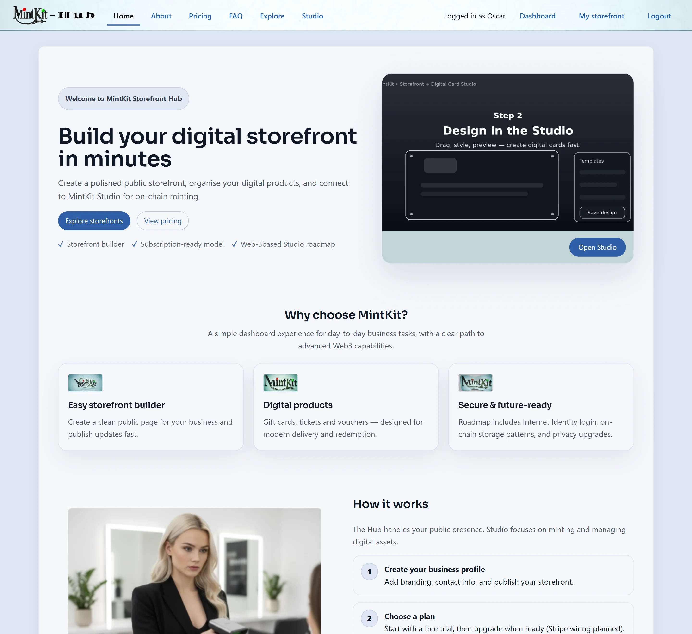
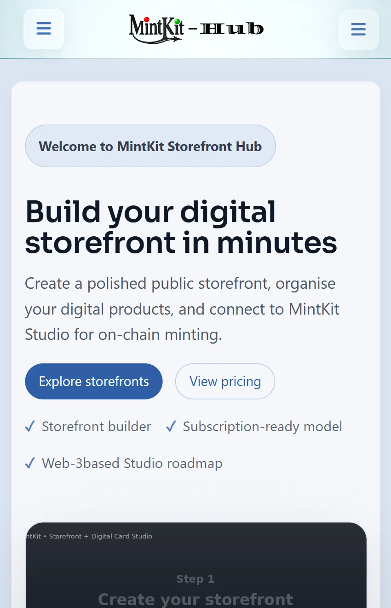
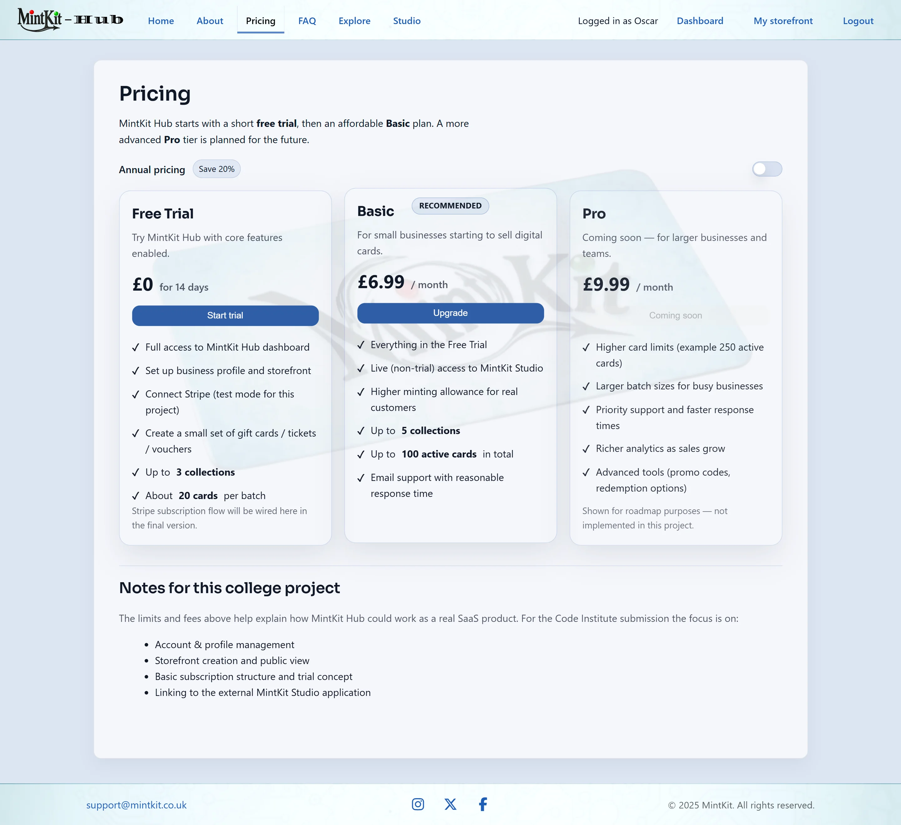
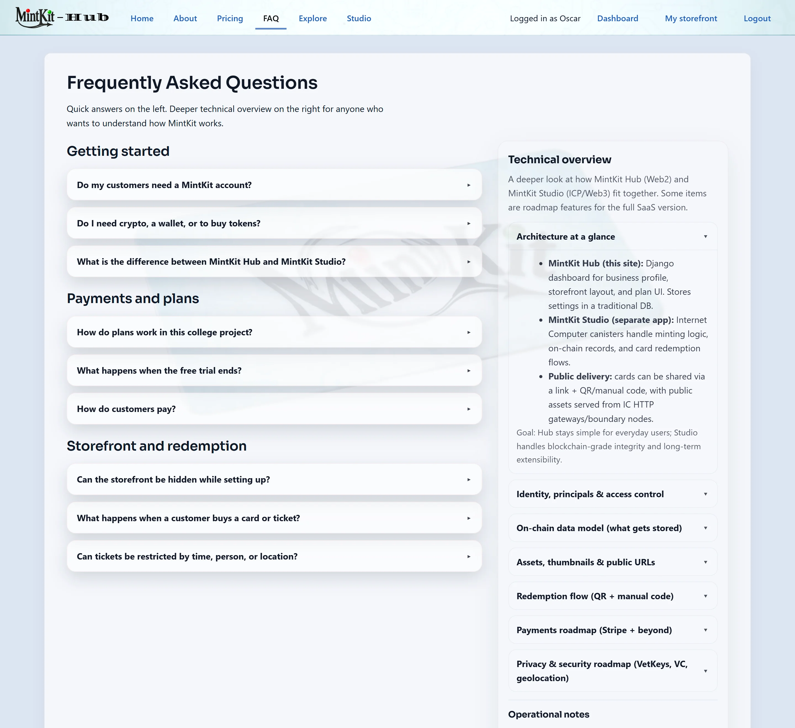
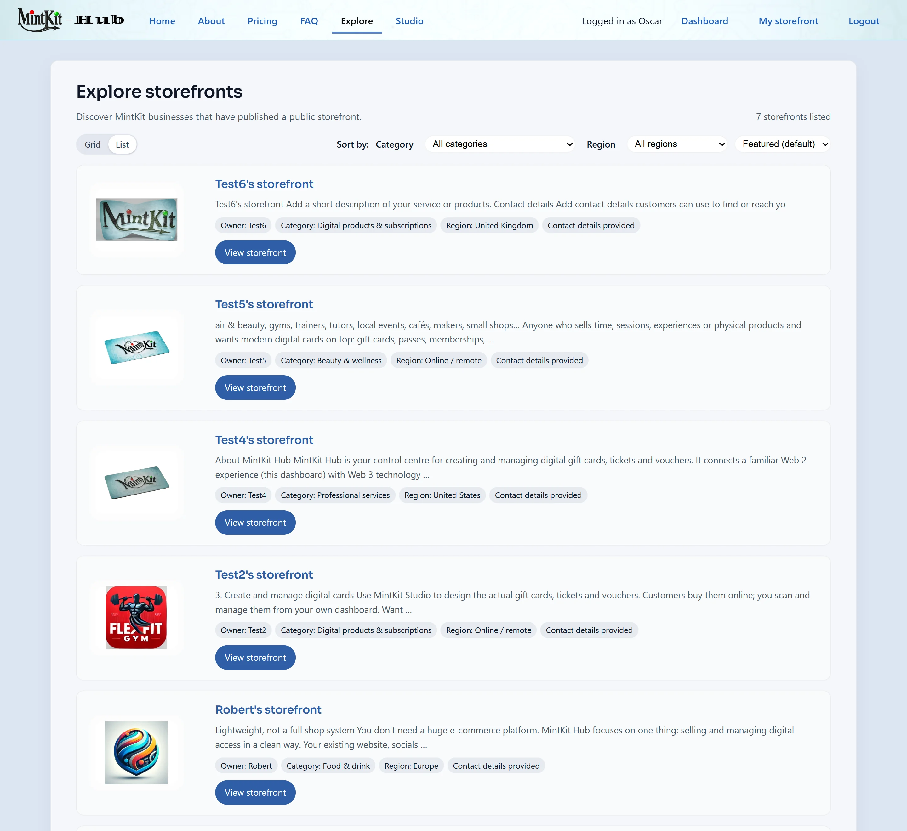
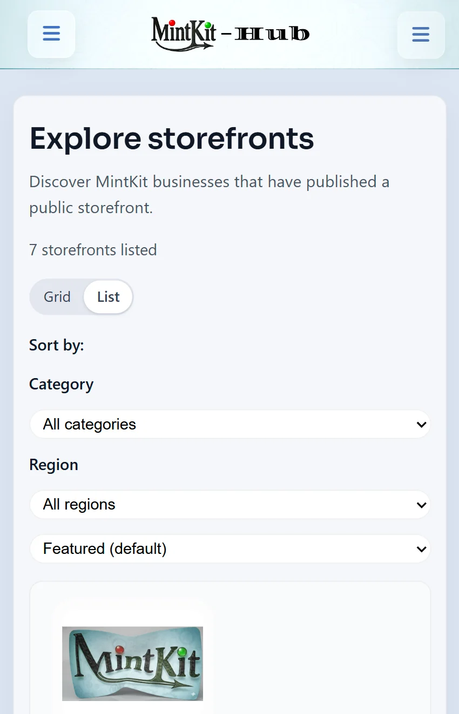
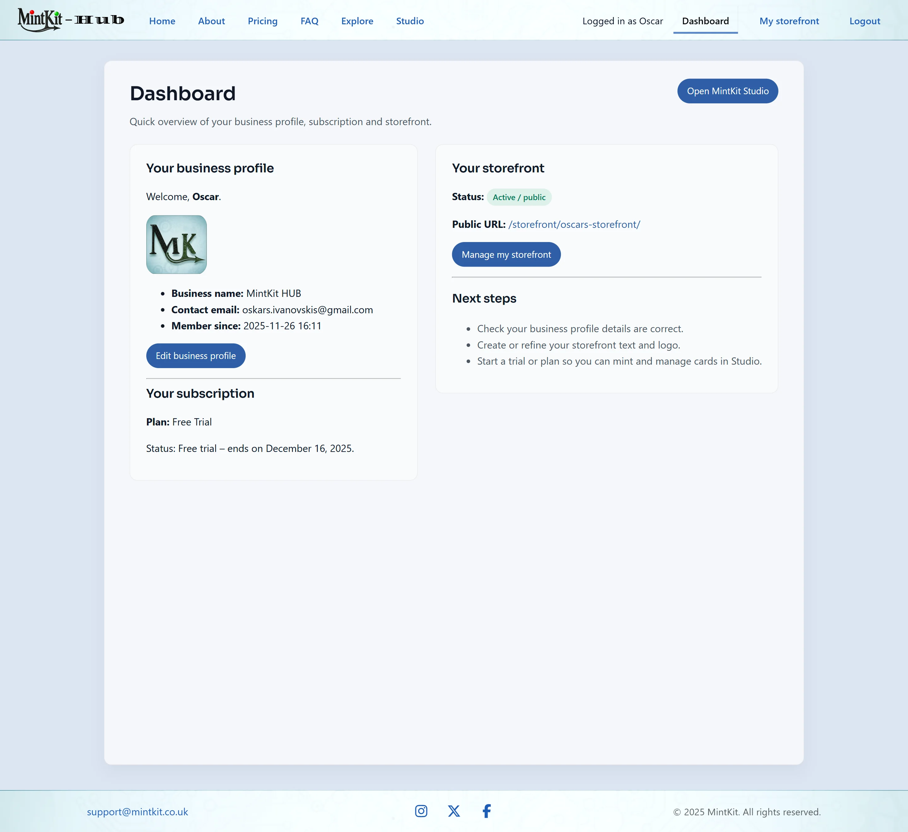
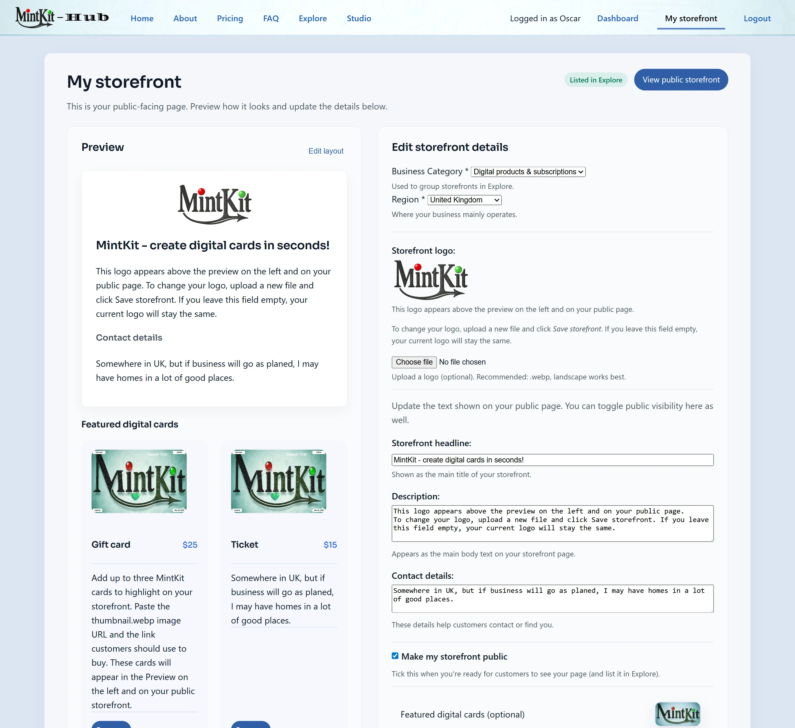
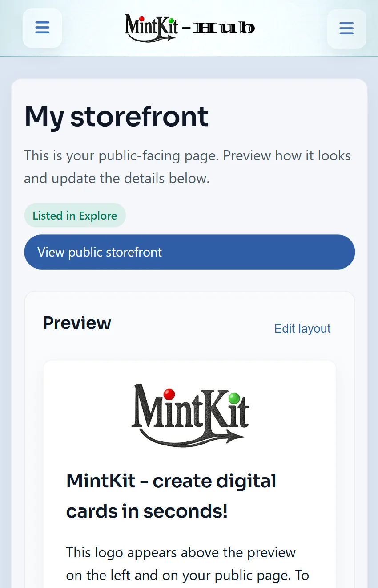

# UX Evidence

## Wireframes

Wireframes are stored in `docs/ux/wireframes/`.

### Key pages (Desktop / Tablet / Mobile layouts)
> All wireframes use the same grayscale UI style for consistency across the project.

#### Home

#### About

#### Pricing

#### FAQ

#### Explore

#### Dashboard

#### My Storefront

## UI Screenshots

Screenshots are stored in `docs/ux/screenshots/`.

### Key Pages (Desktop + Mobile)
- Home
- About
- Pricing
- FAQ
- Explore
- Dashboard
- My Storefront

### Home

  
  

---

### About

  
  

---

### Pricing

  
  

---

### FAQ

  
  

---

### Explore

  
  

---

### Dashboard

  
  

---

### My Storefront

  
  

---