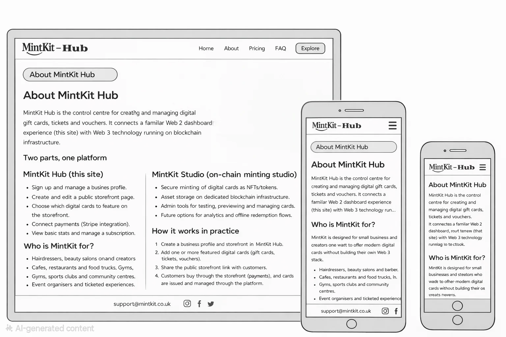
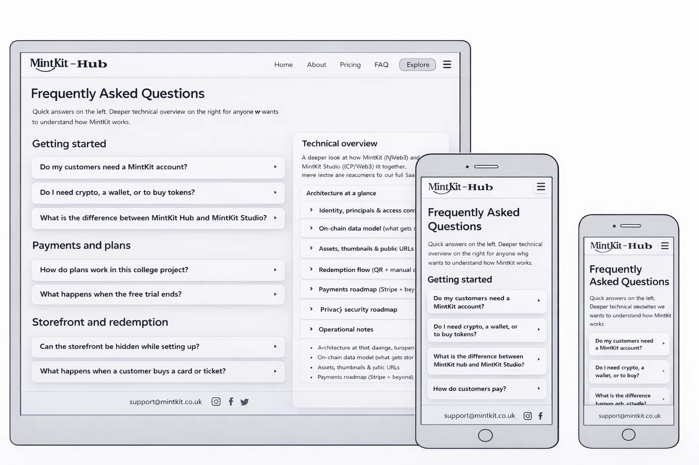
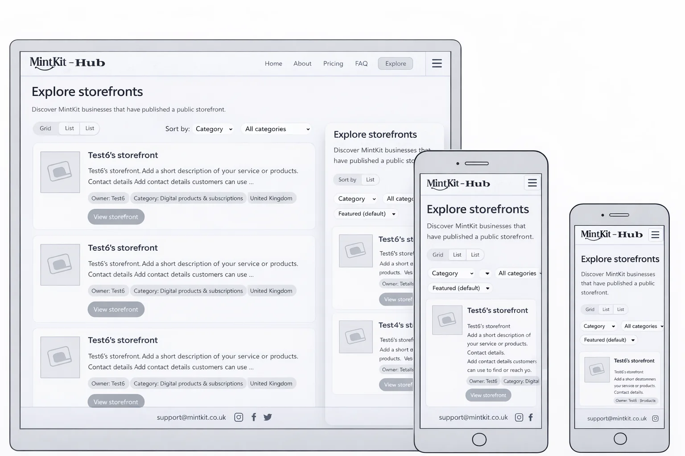
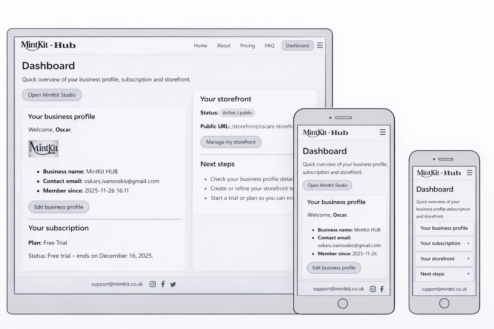
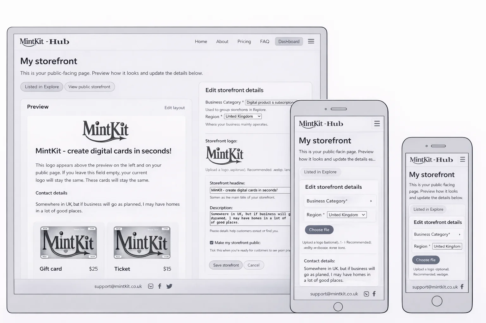

# UX Evidence

## Wireframes

Wireframes are stored in `docs/ux/wireframes/`.

### Key pages (Desktop / Tablet / Mobile layouts)
> All wireframes use the same grayscale UI style for consistency across the project.

#### Home

#### About

#### Pricing

#### FAQ

#### Explore

#### Dashboard

#### My Storefront

## UI Screenshots

Screenshots are stored in `docs/ux/screenshots/`.

### Key Pages (Desktop + Mobile)
- Home
- About
- Pricing
- FAQ
- Explore
- Dashboard
- My Storefront

<!-- Optional: add actual screenshot embeds later, same pattern as wireframes -->
<!--  -->
<!--  -->
